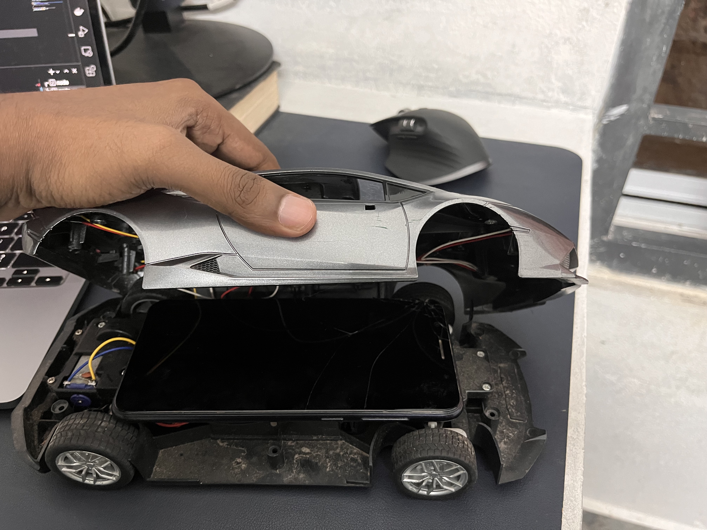
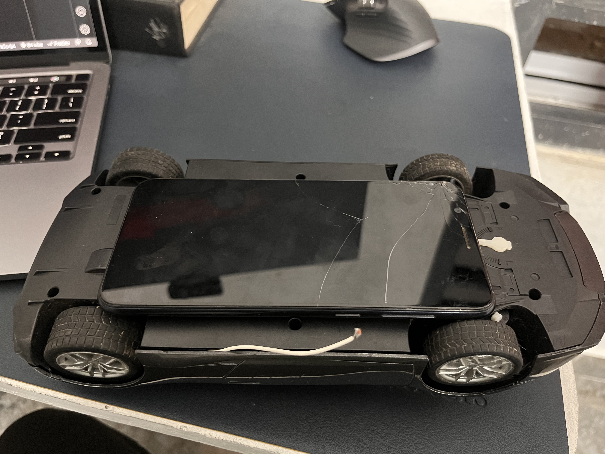

## Digital Twin Made with Android Device -> MQTT-> Hasura -> ReactJS + ThreeJS Dashboard


## Pre Requisites 

* A Hasura cloud project or a local Hasura GraphQL instance (Sign up on https://cloud.hasura.io/ to get a free Hasura project and PostgreSQL DB)
* An Android Device and a toy car
* Node JS, Yarn/ NPM

## Setting up the toy car 

Attach an android device in one of the option as shown below
1.  
2.  


## Getting Started

To Run the MQTT to Hasura service 
```bash
npm run connect
# or
yarn connect
```

To run the React dev server:

```bash
npm run dev
# or
yarn dev
```

Open [http://localhost:3000](http://localhost:3000) with your browser to see the result.

## Setting Up the toy car 


